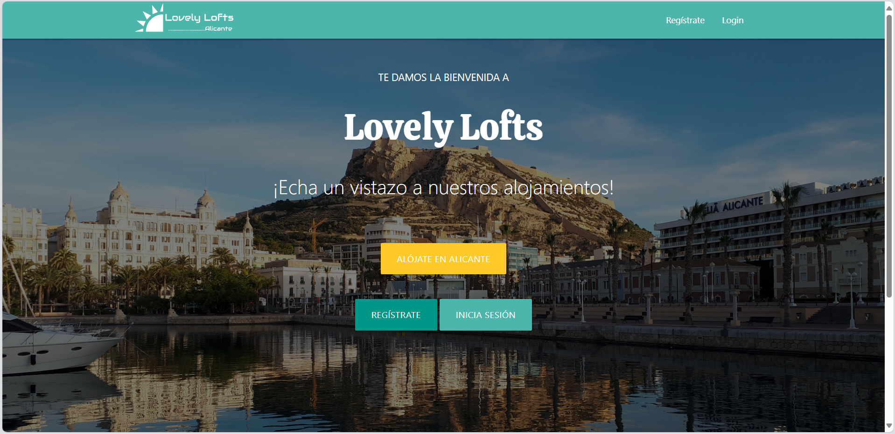
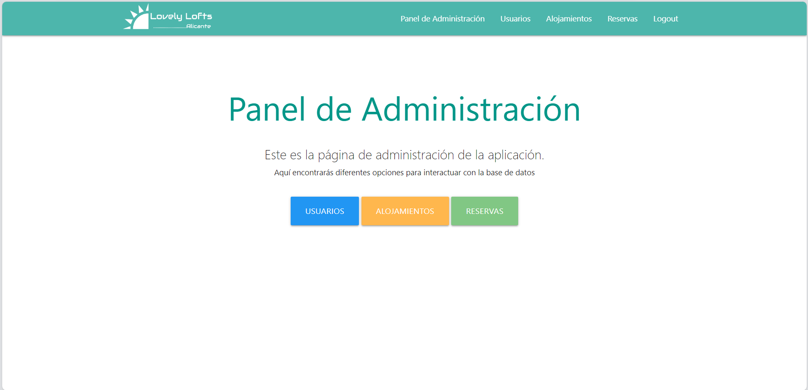
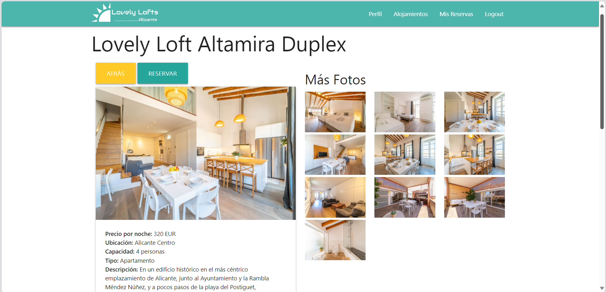
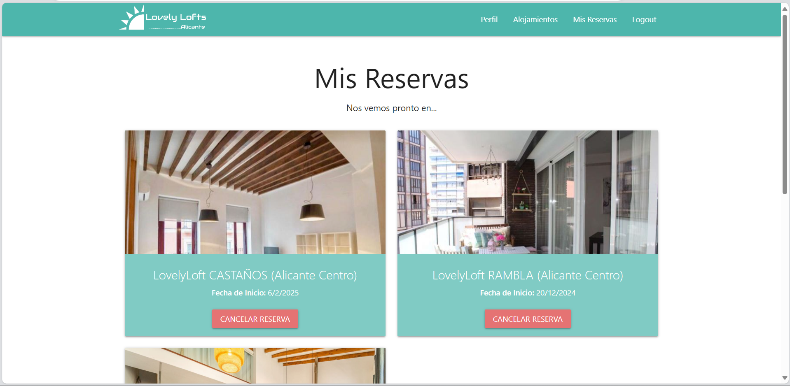

# Trabajo de Fin de Grado sobre Desarrollo de una Plataforma Web de Gestión y Reservas de Alojamientos Turísticos
#### Resumen del proyecto
Este proyecto conforma un Trabajo de Fin de Grado para los estudios en Ingeniería de Tecnologías y Servicios de Telecomunicación.  
Se trata de un desarrollo de una Plataforma Web de Gestión y Reservas de Alojamientos Turísticos que pretende cubrir una necesidad real para una empresa española del sector. La aplicación se ha desarrollado empleando las tecnologías estudiadas durante los cursos del Grado y adaptándose a un diseño actual y visualmente atractivo.

## Descripción:

Esta aplicación web permite gestionar las reservas de alojamientos turísticos de forma online. Facilita la comunicación entre propietarios de alojamientos y clientes, optimizando el proceso de búsqueda, reserva y gestión de estancias.  
El sistema se ha diseñado pensando en la usabilidad y escalabilidad, y permite una gestión autónoma y eficiente de los alojamientos, mejorando la experiencia tanto para los usuarios finales como para los administradores.

## Tecnologías utilizadas:
 


* **Lenguajes de programación:** Node.js (JavaScript)
* **Frameworks:** Express.js
* **Base de datos:** MongoDB (NoSQL)
* **Motor de plantillas:** EJS
* **Diseño web:** Materialize CSS
* **Autenticación:** Passport.js

## :hammer: Funcionalidades del proyecto

- **Sistema de gestión de alojamientos:** Los propietarios pueden publicar sus alojamientos, incluyendo fotos, descripciones, precios y disponibilidad.
- **Sistema de reservas online:** Los clientes pueden buscar y reservar alojamientos según sus preferencias, fechas y presupuesto, con calendario de disponibilidad en tiempo real.
- **Panel de control para propietarios:** Gestión integral de reservas, calendario, comunicación con clientes y estadísticas sobre el uso de sus alojamientos.
- **Panel de control para clientes:** Visualización de reservas realizadas, posibilidad de modificar datos personales, cancelar o cambiar reservas, y realizar pagos.
- **Autenticación de usuarios:** Registro y acceso seguros mediante Passport.js con gestión de sesiones.
- **Interfaz intuitiva y responsive:** Adaptada a dispositivos móviles y escritorio para maximizar la accesibilidad.

## Instalación
* Tener instalado **NodeJS** (versión recomendada >=14)
* Tener instalado **MongoDB** y que esté en ejecución

### Pasos para la instalación
1. Clonar o descargar el repositorio del proyecto.
2. Configurar la conexión a MongoDB en el archivo `app.js` modificando la cadena de conexión:
    ```js
    mongoose.connect('mongodb://127.0.0.1:27017/miaplicaciondb', { useNewUrlParser: true, useUnifiedTopology: true });
    ```  
3. Instalar las dependencias de NodeJS ejecutando:
    ```
    npm install
    ```  
4. Iniciar la aplicación con:
    ```
    node app.js
    ```  
5. Acceder a la plataforma desde el navegador en `http://localhost:3000` (o puerto configurado).

### Configuración adicional
- Variables de entorno (opcional): Puedes usar un archivo `.env` para configurar parámetros sensibles como claves secretas de sesión, puertos, etc.
- Inicialización de datos: Puedes crear datos iniciales de prueba o usuarios administrativos para comenzar a usar la plataforma.

## Ejemplos
(Pendiente añadir ejemplos concretos de uso, comandos, o capturas de pantalla)

## Información adicional

* **Licencia:** (pendiente definir, por ejemplo MIT, GPL...)
* **Recursos adicionales:**
    - Documentación oficial de [Node.js](https://nodejs.org/)
    - Documentación de [Express.js](https://expressjs.com/)
    - Guía de [MongoDB](https://www.mongodb.com/docs/)
    - [Materialize CSS](https://materializecss.com/)
    - [Passport.js](http://www.passportjs.org/)

## Capturas de pantalla

A continuación se muestran algunas capturas de pantalla de la plataforma LovelyLofts para ilustrar su interfaz y funcionalidades principales.

### Interfaz principal de búsqueda de alojamientos


### Panel de control del administrador


### Vista Ejemplo Alojamiento


### Vista Reservas Usuario



## Futuras mejoras y desarrollo

- Implementación de pruebas unitarias y automatizadas para mejorar la robustez del sistema.
- Integración de sistemas de pago online para facilitar transacciones dentro de la plataforma.
- Ampliación multilingüe para soporte a usuarios internacionales.
- Incorporación de inteligencia artificial para recomendaciones personalizadas.
- Implementación de auditorías de seguridad y optimización del rendimiento.
- Despliegue en entornos de producción y configuración de despliegue automático.  

## Contacto

Para dudas, sugerencias o colaboración, contactar con @Pablosyz